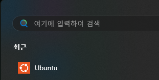
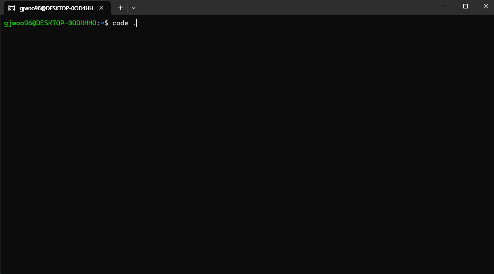
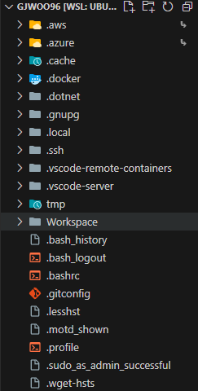
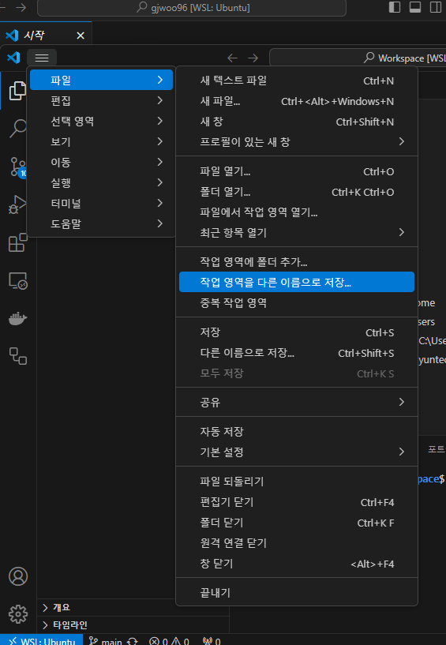
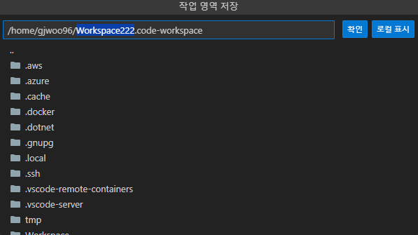
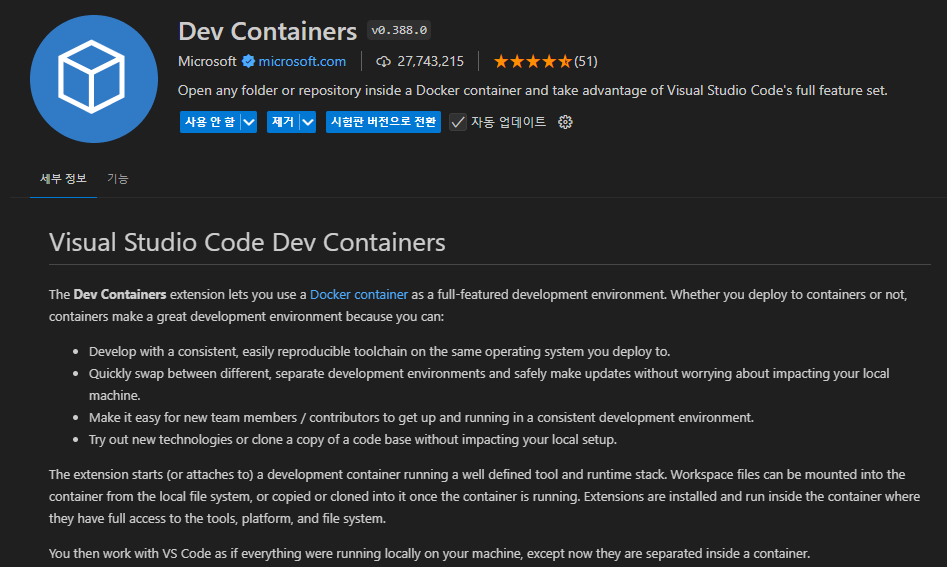
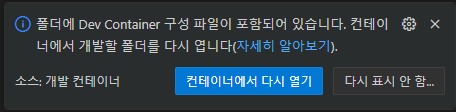
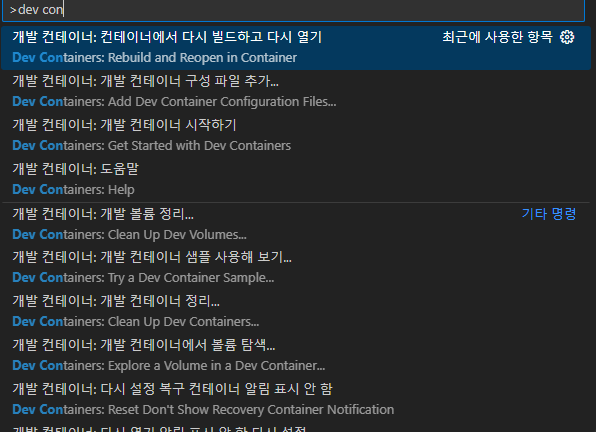

# Getting Started with Create React App

This project was bootstrapped with [Create React App](https://github.com/facebook/create-react-app).

## Available Scripts

In the project directory, you can run:

### `npm start`

Runs the app in the development mode.\
Open [http://localhost:3000](http://localhost:3000) to view it in the browser.

The page will reload if you make edits.\
You will also see any lint errors in the console.

### `npm test`

Launches the test runner in the interactive watch mode.\
See the section about [running tests](https://facebook.github.io/create-react-app/docs/running-tests) for more information.

### `npm run build`

Builds the app for production to the `build` folder.\
It correctly bundles React in production mode and optimizes the build for the best performance.

The build is minified and the filenames include the hashes.\
Your app is ready to be deployed!

See the section about [deployment](https://facebook.github.io/create-react-app/docs/deployment) for more information.

### `npm run eject`

**Note: this is a one-way operation. Once you `eject`, you can’t go back!**

If you aren’t satisfied with the build tool and configuration choices, you can `eject` at any time. This command will remove the single build dependency from your project.

Instead, it will copy all the configuration files and the transitive dependencies (webpack, Babel, ESLint, etc) right into your project so you have full control over them. All of the commands except `eject` will still work, but they will point to the copied scripts so you can tweak them. At this point you’re on your own.

You don’t have to ever use `eject`. The curated feature set is suitable for small and middle deployments, and you shouldn’t feel obligated to use this feature. However we understand that this tool wouldn’t be useful if you couldn’t customize it when you are ready for it.

## Learn More

You can learn more in the [Create React App documentation](https://facebook.github.io/create-react-app/docs/getting-started).

To learn React, check out the [React documentation](https://reactjs.org/).

# 바탕화면에 WSL작업경로 바로가기 생성방법 (처음할때 귀찮지만 한번해두면 편함)
1. 윈도우 검색에서 우분투 검색 
2. 클릭후 명령어 입력(code .) 
3. vscode로 해당 디렉토리 열린 후 작업할 폴더 생성 
4. ctrl + shift + ~ 로 커맨드창 열고 cd 생성한 폴더명 > code .
5.   사진처럼 해당 경로를 바탕화면에 바로가기로 생성(두번째 사진에서 로컬표시 버튼 클릭하고 바탕화면에 저장하고싶은 이름으로 저장하면 완료)
6. 바탕화면에 바로가기 만들어서 클릭하면 vscode로  WSL > 생성한 경로로 바로 이동가능

# Vscode DevConatiner 사용법
0. VScode에 DevConatiner extension 설치 
1. WSL에서 생성한 경로에서 프로젝트 git clone
2. ctrl + shift + ~ 로 커맨드창 열고, 내려받은 프로젝트로 현재경로를 이동후 code . 명령어를 입력하여 해당 경로에서 VScode를 실행
3. 2번을 진행후 vscode를 실행하면 우측 하단에 사진과 같은 안내창이 뜨게됨, 컨테이너 다시 열기 클릭 
> 안내창이 뜨지않을경우 F1눌러서 dev containers:rebuild 까지 입력하면 사진과 같은 항목이 나옴 클릭 후 컨테이너 실행 
4. 프로젝트의 데브컨테이너가 실행완료 후 새로운 커맨드창 열고 (ctrl + shift + ~) 프로젝트의 의존성 설치(yarn install) *프로젝트를 내려받고 처음만 해주면됨
5. yarn start로 프로젝트 실행 