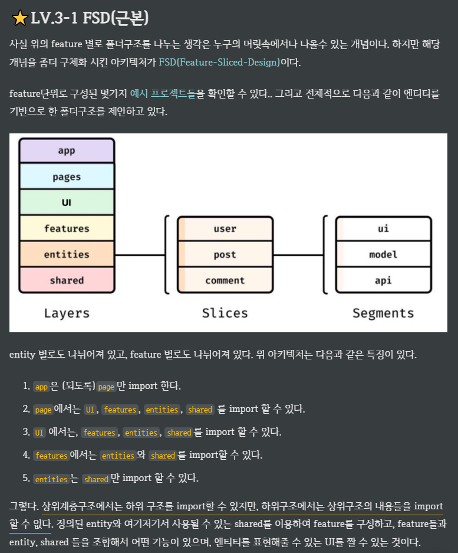
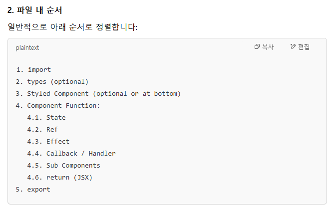
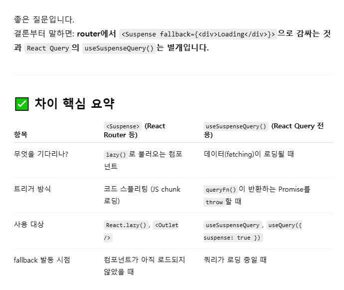

# 프로젝트 구조


<br />


> ESLint + Prettier 설정을 통해 일관된 포맷 유지 가능
<br />


<br />

---

## 참조
https://joong-sunny.github.io/react/react7/

## 폴더 구조(요약)
```bash
📦src
 ┣ 📂app        🦺 파트별 메인 컴포넌트
 ┣ 📂contexts   🥽 전역 기능
 ┃ ┣ 📂router       🥽 router
 ┃ ┗ 📂store        🥽 redux
 ┣ 📂features   🥼 파트별 상세 구조
 ┃ ┣ 📂board
 ┃ ┃ ┣ 📂components 🥼 component
 ┃ ┃ ┣ 📂hooks      🥼 커스텀훅(useQuery)
 ┃ ┃ ┣ 📂services   🥼 api
 ┃ ┃ ┣ 📂types      🥼 type, interface
 ┣ 📂layout     👔 전체 구조
 ┃ ┣ 📂Footer
 ┃ ┣ 📂Header
 ┃ ┗ 📂SideMenu
 ┣ 📂pages      👕 최초 페이지
 ┣ 📂shared     🦺 공통
 ┣ 📂styles     👖 공통 스타일
 ┣ 📜App.tsx    🧤 상단 컴포넌트
 ┣ 📜index.tsx  🧦 최상단 컴포넌트
```

## 폴더 구조(FSD 아키텍처 - 기본)
```bash
📦src
 ┣ 📂__tests__  👓 TDD
 ┣ 📂app        🦺 파트별 메인 컴포넌트
 ┣ ┣ 📂create
 ┃ ┣ 📂detail
 ┃ ┃ ┗ 📜index.tsx
 ┃ ┗ 📂list
 ┣ 📂assets     🕶 모든 image, font 등의 CDN 서버
 ┣ 📂contexts   🥽 전역 기능 -> router, ContextAPI, redux..
 ┃ ┣ 📂router       🥽 router
 ┃ ┗ 📂store        🥽 redux
 ┣ 📂features   🥼 파트별 상세 구조
 ┃ ┣ 📂board
 ┃ ┃ ┣ 📂components 🥼 component
 ┃ ┃ ┃ ┣ 📂create
 ┃ ┃ ┃ ┣ 📂detail
 ┃ ┃ ┃ ┃ ┣ 📜Main.tsx
 ┃ ┃ ┃ ┃ ┗ 📜Review.tsx
 ┃ ┃ ┃ ┣ 📂list
 ┃ ┃ ┣ 📂services   🥼 api
 ┃ ┃ ┣ 📂types      🥼 type, interface
 ┣ 📂layout     👔 전체 구조
 ┃ ┣ 📂Footer
 ┃ ┣ 📂Header
 ┃ ┗ 📂SideMenu
 ┣ 📂pages      👕 router 이동 경로(=최초 페이지)
 ┃ ┣ 📂board
 ┃ ┃ ┗ 📜index.tsx
 ┃ ┣ 📂dashboard
 ┃ ┗ 📂shared-theme
 ┣ 📂shared     🦺 공통
 ┃ ┣ 📂components   🦺 <Button /> 등의 공통 컴포넌트
 ┃ ┣ 📂hooks        🦺 ~~[미구현]~~ 커스텀훅
 ┃ ┣ 📂services     🦺 axios 설정
 ┃ ┣ 📂utils        🦺 단순 유틸 함수
 ┣ 📂styles     👖 공통 스타일(css)
 ┣ 📜App.tsx    🧤 상단 컴포넌트 -> 레이아웃 구조 설정(컴포넌트 위주)
 ┣ 📜index.tsx  🧦 최상단 컴포넌트 -> Provider 설정(options 위주)
```

---

## 폴더 구조
```bash
📦src
 ┣ 📂app
 ┃ ┣ 📂board
 ┃ ┃ ┣ 📂create
 ┃ ┃ ┣ 📂detail
 ┃ ┃ ┗ 📂list
 ┃ ┗ 📂member
 ┣ 📂assets
 ┣ 📂contexts
 ┃ ┣ 📂router
 ┃ ┗ 📂store
 ┣ 📂features
 ┃ ┣ 📂board
 ┃ ┃ ┣ 📂components
 ┃ ┃ ┃ ┣ 📂create
 ┃ ┃ ┃ ┣ 📂detail
 ┃ ┃ ┃ ┗ 📂list
 ┃ ┃ ┣ 📂services
 ┃ ┃ ┗ 📂types
 ┃ ┗ 📂member
 ┃ ┃ ┣ 📂components
 ┃ ┃ ┣ 📂services
 ┃ ┃ ┗ 📂types
 ┣ 📂layout
 ┃ ┣ 📂Footer
 ┃ ┣ 📂Header
 ┃ ┗ 📂SideMenu
 ┣ 📂pages
 ┃ ┣ 📂board
 ┃ ┗ 📂dashboard
 ┣ 📂shared
 ┃ ┣ 📂components
 ┃ ┣ 📂hooks
 ┃ ┣ 📂services
 ┃ ┣ 📂shared-theme
 ┃ ┗ 📂utils
 ┣ 📂styles
 ┣ 📂__tests__
 ┣ 📜App.tsx
 ┣ 📜index.tsx
```

## 파일 구조
```bash
📦src
 ┣ 📂app
 ┃ ┣ 📂board
 ┃ ┃ ┣ 📂create
 ┃ ┃ ┃ ┗ 📜index.tsx
 ┃ ┃ ┣ 📂detail
 ┃ ┃ ┃ ┗ 📜index.tsx
 ┃ ┃ ┗ 📂list
 ┃ ┃ ┃ ┗ 📜index.tsx
 ┃ ┗ 📂member
 ┃ ┃ ┗ 📂sign-in
 ┃ ┃ ┃ ┗ 📜index.tsx
 ┣ 📂assets
 ┣ 📂contexts
 ┃ ┣ 📂router
 ┃ ┃ ┗ 📜configRouter.tsx
 ┃ ┗ 📂store
 ┃ ┃ ┣ 📂modules
 ┃ ┃ ┃ ┣ 📂board
 ┃ ┃ ┃ ┃ ┗ 📜index.ts
 ┃ ┃ ┃ ┗ 📜index.ts
 ┃ ┃ ┗ 📜configStore.ts
 ┣ 📂features
 ┃ ┣ 📂board
 ┃ ┃ ┣ 📂components
 ┃ ┃ ┃ ┣ 📂create
 ┃ ┃ ┃ ┣ 📂detail
 ┃ ┃ ┃ ┃ ┣ 📜Main.tsx
 ┃ ┃ ┃ ┃ ┣ 📜PaymentForm.tsx
 ┃ ┃ ┃ ┃ ┗ 📜Review.tsx
 ┃ ┃ ┃ ┗ 📂list
 ┃ ┃ ┃ ┃ ┣ 📜Category.tsx
 ┃ ┃ ┃ ┃ ┣ 📜HeaderContent.tsx
 ┃ ┃ ┃ ┃ ┗ 📜MainContent.tsx
 ┃ ┃ ┣ 📂services
 ┃ ┃ ┃ ┗ 📜board.ts
 ┃ ┃ ┗ 📂types
 ┃ ┃ ┃ ┗ 📜board.ts
 ┃ ┗ 📂member
 ┃ ┃ ┣ 📂components
 ┃ ┃ ┃ ┗ 📂sign-in
 ┃ ┃ ┃ ┃ ┣ 📜CustomIcons.tsx
 ┃ ┃ ┃ ┃ ┗ 📜ForgotPassword.tsx
 ┃ ┃ ┣ 📂services
 ┃ ┃ ┗ 📂types
 ┣ 📂layout
 ┃ ┣ 📂Footer
 ┃ ┃ ┣ 📂components
 ┃ ┃ ┃ ┗ 📜Copyright.tsx
 ┃ ┃ ┗ 📜index.tsx
 ┃ ┣ 📂Header
 ┃ ┃ ┣ 📂components
 ┃ ┃ ┃ ┣ 📜MenuButton.tsx
 ┃ ┃ ┃ ┣ 📜NavbarBreadcrumbs.tsx
 ┃ ┃ ┃ ┗ 📜ScrollTop.tsx
 ┃ ┃ ┗ 📜index.tsx
 ┃ ┗ 📂SideMenu
 ┃ ┃ ┣ 📂components
 ┃ ┃ ┃ ┣ 📜MenuContent.tsx
 ┃ ┃ ┃ ┣ 📜OptionsMenu.tsx
 ┃ ┃ ┃ ┗ 📜SelectContent.tsx
 ┃ ┃ ┣ 📜SideMenu.tsx
 ┃ ┃ ┗ 📜SideMenuMobile.tsx
 ┣ 📂pages
 ┃ ┣ 📂board
 ┃ ┃ ┗ 📜index.ts
 ┃ ┗ 📂dashboard
 ┃ ┃ ┣ 📂components
 ┃ ┃ ┃ ┣ 📜AppNavbar.tsx
 ┃ ┃ ┃ ┣ 📜CustomizedDataGrid.tsx
 ┃ ┃ ┃ ┗ 📜MainGrid.tsx
 ┃ ┃ ┣ 📂internals
 ┃ ┃ ┃ ┣ 📂components
 ┃ ┃ ┃ ┃ ┗ 📜Copyright.tsx
 ┃ ┃ ┃ ┗ 📂data
 ┃ ┃ ┃ ┃ ┗ 📜gridData.tsx
 ┃ ┃ ┗ 📜index.tsx
 ┣ 📂shared
 ┃ ┣ 📂components
 ┃ ┃ ┗ 📜Search.tsx
 ┃ ┣ 📂hooks
 ┃ ┣ 📂services
 ┃ ┃ ┗ 📜index.ts
 ┃ ┣ 📂shared-theme
 ┃ ┗ 📂utils
 ┃ ┃ ┣ 📜dataUtil.ts
 ┃ ┃ ┗ 📜dateUtil.ts
 ┣ 📂styles
 ┃ ┗ 📜GlobalStyle.tsx
 ┣ 📂__tests__
 ┣ 📜App.tsx
 ┣ 📜index.tsx
 ```