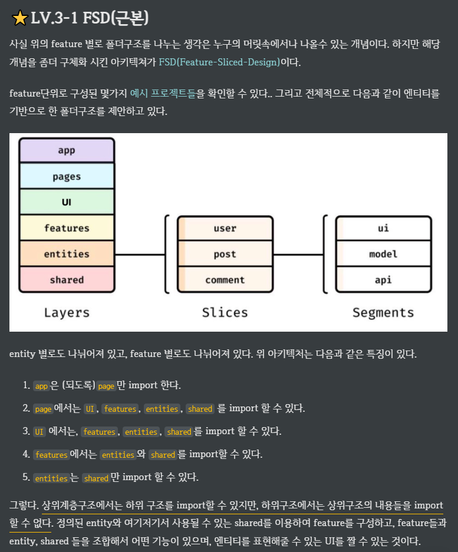

# 프로젝트 구조


<br />

## 폴더 구조(요약)
```bash
📦src
 ┣ 📂app        🦺 파트별 메인 컴포넌트
 ┃ ┣ 📂board
 ┃ ┃ ┣ 📂create
 ┃ ┃ ┃ ┗ 📜index.tsx
 ┃ ┃ ┣ 📂detail
 ┃ ┃ ┣ 📂edit
 ┃ ┃ ┗ 📂list
 ┣ 📂contexts   🥽 전역 기능
 ┃ ┣ 📂router       🥽 router
 ┃ ┗ 📂store        🥽 redux
 ┣ 📂features   🥼 파트별 상세 구조
 ┃ ┣ 📂board
 ┃ ┃ ┣ 📂components 🥼 component
 ┃ ┃ ┃ ┣ 📂create
 ┃ ┃ ┃ ┣ 📂detail
 ┃ ┃ ┃ ┣ 📂edit
 ┃ ┃ ┃ ┗ 📂list
 ┃ ┃ ┣ 📂hooks      🥼 커스텀훅(useQuery)
 ┃ ┃ ┣ 📂services   🥼 api
 ┃ ┃ ┣ 📂types      🥼 type, interface
 ┣ 📂layout     👔 전체 구조
 ┃ ┣ 📂Footer
 ┃ ┣ 📂Header
 ┃ ┗ 📂SideMenu
 ┣ 📂pages      👕 최초 페이지
 ┣ 📂shared     🦺 공통
 ┣ 📂styles     👖 공통 스타일
 ┣ 📜App.tsx    🧤 상단 컴포넌트
 ┣ 📜index.tsx  🧦 최상단 컴포넌트
```

## 게시판(Board)
- List, Detail, Create, Edit
- Tag, Like, Review

## 기본 동작
1. `index.tsx` App.tsx
2. `layout` SideMenu -> MenuContent.tsx(하드코딩)
3. ~~`pages` index.tsx~~
4. `app` index.tsx : 하기 내용 조합하여 사용
    1. `features` components : 필요 시 분리(ex: styled, Wrapper, Header, Main)
    2. `hooks` board.ts : useQuery | useSuspenseQuery
    3. `services` board.ts : axios
    4. `types` board.ts : type { axios: response }

## 상세 동작
1. `detail` useQuery(id) 호출 데이터를 각 컴포넌트에 전달하여 조회(MUI 위주)
2. `list` useQuery(page) 호출 데이터 조회(MUI 위주)
    1. `useState` page 저장
    2. `<Pagination />` 컴포넌트의 onChange : setPage() 진행
    3. 재랜더링(마운트)되며, useQuery(page) 재실행되어 조회 데이터 변경
3. `create` `edit` Form 위주
    1. `useForm` zod 의 schema, type, defaultValues 를 기반으로 생성
        - `convertDefaultValues` basicValues 빈값으로 변환 후 defaultValues 로 전달
    2. `<Form />` 생성한 useForm() 으로 컴포넌트 생성 및 연결
    3. `useEffect[]` 최초 실행 시에 reset 으로 셋팅
        1. `create` basicValues 가 존재할 수도 있음(ex: checkbox, radio)
        2. `edit` useQuery(id) 호출 데이터(응답 시간이 있어 data 로 진행)
            - `convertData` null 데이터를 '' 으로 변환
    4. `onSubmit` useMutation 실행
        - `convertValues` 빈값('') 데이터를 null 로 변환
        1. `onSuccess` <Modal>alert 실행 후 navigate 를 통해 페이지 이동
        2. `onError` <Modal>alert 로 오류 발생 메세지 출력
    5. `useEffect[isSuccess]` reset 으로 전송한 데이터 저장 -> 추후 임시 데이터 저장?
        - `formState(isSubmitSuccessful)` 유효성(정합성) 검증만 성공하면 api 결과 상관없이 submit 시도는 성공으로 처리되어 사용하면 안됨

## Etc
1. `절대 경로` `../../` -> `@` 를 통한 절대 경로 수정
    - `CRA` webpack 설정 변경이 안되어 `craco` 로 변경 -> 추후 `Vite`?
2. `FSD 아키텍처`

## TODO:
1. `useState` 좋아요 갱신 실패
2. `create` `edit` 같은 컴포넌트에 `mode` props 로 진행하고 싶었으나 커스텀훅(useQuery)이 최상위로 조건부 서식이 안되어 실패
3. `<Form>` 공통 컴포넌트 내부에 useForm 위치시키려했으나 실패
4. `useParams` hooks | services 대신 컴포넌트에서 실행 후 전달되게 변경
5. [예정] `type` schema 및 type SchemaType = z.infer<typeof schema>; 를 분리하여 types 에 보관 -> defaultValues 도??(+convert)
    - 해당 type 을 Main, services, hooks 에서 useMutation 의 request 타입으로 활용
    - SearchCondition, Request, Response(공통 + 개별)
6. `null-safe` data | undefined 의 경우, 일일히(개별) -> 처리 ?? 커스텀훅 생성
    - `useQuery` data | undefined 
    - `useSuspenseQuery` data
    - [예정] `useQueryClient`, `queryOptions` 현재 미사용
7. `Loading` Suspense
    1. `router` 컴포넌트 로딩
    2. `useQuery` 쿼리 로딩 -> 개별 대신 공통이 가능??
        - const { isLoading, isPending } = useQuery();
8. `extends` 어떤 데이터가 전달될 지 모를때 | type 이 필요할 때 -> any 대신??
    ```typeScript
    1. interface Board extends BaseType { ... } 
    2. const Form({ data }: { data: BaseType }) { ... }
    3. const { data } = useQuery<Board>
    4. <Form data={data} />
    ```
9. `response` 문서(Guide) 참조하여 모든 api 의 response 를 type 으로 생성??
    ```typeScript
    1. axios<Type>
    2. useQuery<Type>
    3. useBoard<Type>
    ```
10. `Delete` BE 가 express 라 `HardDelete` 진행(DB - cascade 활용) -> 추후 BE 변경 시 `SoftDelete` 진행
11. `TDD` RTL(react-testing-library), 디버깅
    - [유닛테스트(Jest)](https://coding-god-life.tistory.com/157)
12. `etc` util | 커스텀훅 -> useMemo, useCallback

## 건우
1. `pretter` | `ESLint` 정적 분석 도구, Lint 검사
2. `openAI` api, LLM, MCP
3. `Zustand` 활용
4. `Cursor` 후기 -> IDE??
5. 깃허브 - `Nest`